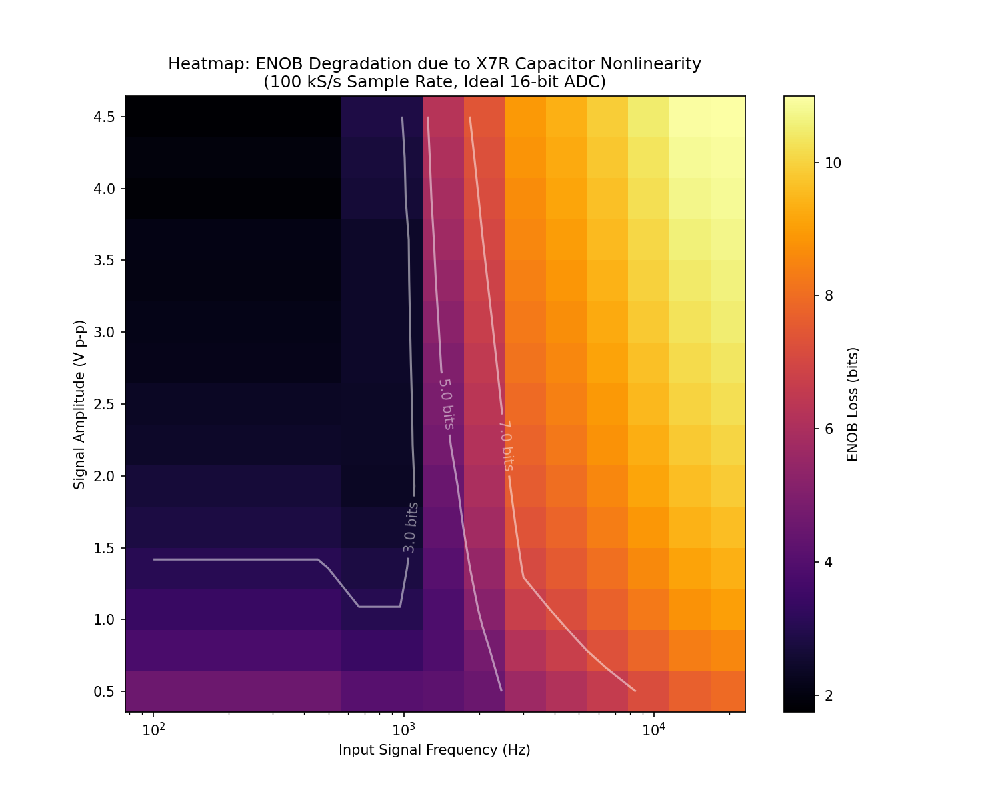

# Voltage-Dependent Ceramic Capacitors as a Source of Dynamic Error in SAR ADC Front Ends

## Charge-Conserving Modeling, Simulation Pitfalls, and ENOB Degradation

**Boris F. Kuznetsov, Professor, Doctor of Technical Sciences**  
*Central Asian Institute of Engineering, Dentistry and Medicine (CAEDMI)*  
*Bishkek, Kyrgyzstan*

### Abstract

Multilayer ceramic capacitors based on Class II dielectrics, such as X7R and X5R, are widely used in compact analog front ends because they provide high capacitance density at low cost [7]. However, their capacitance is not constant. It depends strongly on applied voltage, temperature, package size, dielectric formulation, and DC bias. In low-accuracy circuits this effect is often acceptable. In precision data acquisition systems, especially in front ends driving high-resolution SAR analog-to-digital converters, the same effect can become a significant source of deterministic nonlinear error.

This article examines how voltage-dependent capacitance can degrade the dynamic performance of an ADC input path. The focus is not merely on the loss of nominal capacitance under DC bias, but on the distortion mechanism created when a nonlinear capacitor is charged and discharged by a time-varying input signal. In a sample-and-hold system, the final voltage captured at the end of the acquisition interval can deviate from the ideal sampled value in an amplitude-dependent and history-dependent manner. This error appears in the digitized spectrum as harmonic distortion and reduces SINAD and ENOB.

A second topic is the modeling method itself. A nonlinear capacitor should be represented through a physically consistent charge-voltage relationship, $Q(V)$, rather than through a naive time-step update of an instantaneous capacitance value $C(V)$. Incorrect behavioral models may inject or remove charge numerically and can produce distortion components that are artifacts of the simulation rather than properties of the physical circuit. A charge-conserving formulation avoids this failure mode and allows the designer to estimate ADC degradation with better confidence.

Representative simulations show that distortion is most severe under large-signal operation and can peak near the transition band of the input RC network rather than at the highest signal frequency. For a 16-bit, 100 kS/s acquisition example using a 10 nF front-end capacitor and a 4.4 V peak-to-peak input signal biased at 2.5 V, an ideal linear capacitor preserves high dynamic performance, while X7R and X5R models can reduce the effective resolution by several bits. The practical conclusion is straightforward: Class II ceramic capacitors should not be used blindly in precision signal paths. If they must be used, their nonlinear behavior should be modeled with a charge-based method and verified against design margins.

---

## 1. Introduction

A common assumption in mixed-signal design is that an ADC data sheet defines the achievable resolution of the measurement system. In practice, the ADC is only one part of the signal chain. The input driver, anti-alias filter, sampling network, PCB parasitics, reference network, and passive components can all determine whether the advertised performance is actually achieved.

Consider a typical case. A designer selects a 16-bit SAR ADC, uses a low-noise reference, pays attention to layout, and chooses a compact ceramic capacitor in the input filter or acquisition network. The capacitor is attractive: it is small, inexpensive, readily available, and has a nominal capacitance value large enough to meet the intended RC time constant. The selected dielectric is X7R or X5R because a C0G/NP0 capacitor of the same value and package size is unavailable or too large.

During evaluation, the DC accuracy may appear acceptable. The circuit may settle, the reference may be clean, and the RMS noise may be within expectation. However, when a sinusoidal input is sampled and the FFT of the output code stream is examined, the spectrum may show strong second- and third-order harmonics. The measured SINAD is far below the expected value, and the calculated ENOB can drop from the nominal 16-bit region into the range of 10, 9, or even 8 effective bits depending on signal amplitude and front-end parameters.

The ADC core did not necessarily “lose” those bits. They were lost in the analog front end before conversion.

One important mechanism behind this behavior is the voltage coefficient of capacitance of Class II ceramic dielectrics. X7R and X5R capacitors can lose a substantial portion of their capacitance under DC bias [2]. More importantly for dynamic signal acquisition, their incremental capacitance changes as the instantaneous voltage changes. A capacitor placed in a signal path is therefore not simply a linear storage element with a fixed value. It becomes a nonlinear element whose stored charge is a nonlinear function of voltage.

In an ADC front end this matters because sampling is a dynamic process. During the acquisition interval, a source charges the sampling network through a finite impedance. If the capacitance is constant, the settling process is described by a linear exponential response. If the capacitance depends on voltage, the time constant changes throughout the transition. The final voltage at the sampling instant is then not merely a delayed version of the input. It contains deterministic nonlinear error. Since the error depends on signal amplitude and previous state, it creates harmonic distortion.

This article analyzes that effect using a charge-conserving model [1]. The purpose is practical: to show when voltage-dependent ceramic capacitors can become a dominant error source, how to model the effect without introducing numerical artifacts, and how to make design decisions that protect ADC dynamic performance.

## 2. The ADC Front End Is Part of the Converter

A SAR ADC does not observe an input voltage in an abstract mathematical sense. It acquires charge through a physical input network.

In a simplified single-ended front end, the signal source or driver amplifier feeds an RC filter. The ADC input presents a switched-capacitor load. During the acquisition phase, an internal switch connects the sampling capacitor to the input pin. During the conversion phase, the sampling capacitor is disconnected and the ADC performs the binary search operation. The voltage stored at the end of acquisition becomes the initial condition for conversion.

Even in this simplified description, several impedances and capacitances influence the sampled value:

* The source has a finite output impedance.
* The RC filter has a finite resistance.
* The ADC switch has a finite on-resistance.
* The ADC sampling capacitor has a finite value.
* External capacitors may be connected from the ADC input to ground or across differential inputs.
* The acquisition time is finite.
* The input voltage changes during acquisition if the signal frequency is not negligible compared with the sampling rate and front-end bandwidth [3].

With ideal linear capacitors, this network can usually be analyzed with linear time-domain or frequency-domain methods. Settling error can be estimated from the time constant, and distortion is not generated by the capacitor itself. Any nonlinearity would have to come from the driver amplifier, the ADC input switch, dielectric absorption, reference modulation, or other secondary mechanisms.

With Class II ceramic capacitors, the capacitor itself becomes nonlinear. The capacitance is not a fixed parameter. It is a function of voltage:

$$ C = C(V) $$

This expression is often used informally, but it must be handled carefully. A real capacitor stores charge. The fundamental relationship is not capacitance versus voltage, but charge versus voltage:

$$ Q = Q(V) $$

The small-signal or differential capacitance is then

$$ C_d(V) = \frac{dQ(V)}{dV} $$

This distinction is essential. If the voltage across the capacitor changes during acquisition, the current is

$$ i(t) = \frac{dQ}{dt} $$

and therefore

$$ i(t) = C_d(V) \frac{dV}{dt} $$

For a linear capacitor, $C_d(V)$ is constant and the familiar equation $i = C \frac{dV}{dt}$ is recovered. For a voltage-dependent capacitor, the current-voltage relationship changes continuously with the operating point.

This is the physical origin of distortion in the ADC front end.

## 3. Why a Nonlinear Capacitor Produces Harmonic Distortion

To understand the distortion mechanism, consider a capacitor connected through an equivalent resistance $R_{eq}$ to a time-varying input voltage $v_{in}(t)$. The voltage across the capacitor is $v_c(t)$. The resistor current is

$$ i_R(t) = \frac{v_{in}(t) - v_c(t)}{R_{eq}} $$

The capacitor current is

$$ i_C(t) = \frac{dQ(v_c)}{dt} $$

Equating the two currents gives

$$ \frac{dQ(v_c)}{dt} = \frac{v_{in}(t) - v_c(t)}{R_{eq}} $$

or, using the differential capacitance,

$$ C_d(v_c) \frac{dv_c}{dt} = \frac{v_{in}(t) - v_c(t)}{R_{eq}} $$

For a constant capacitor, this is a linear first-order differential equation. For a Class II ceramic capacitor, $C_d(v_c)$ varies with voltage. The equation becomes nonlinear.

This nonlinearity has two important consequences.

First, the effective time constant is signal-dependent:

$$ \tau(v_c) = R_{eq} C_d(v_c) $$

As the input waveform moves through different voltage regions, the capacitor charges at different rates. The waveform at the capacitor is therefore not simply a filtered version of the input sinusoid. Its shape is distorted.

Second, the error at the sampling instant depends on both the present input voltage and the previous capacitor voltage. In a sampled system, this means the error has memory. It is not equivalent to a static transfer curve that can be corrected with a simple lookup table. The exact error depends on amplitude, frequency, acquisition time, source impedance, sample rate, and the voltage history of the capacitor.

If the input is sinusoidal, an amplitude-dependent error creates harmonics. In a single-ended ADC front end with a DC offset, the nonlinear capacitance curve is usually not symmetric around the signal midpoint. As a result, even-order harmonics, especially the second harmonic, can become prominent. Third-order distortion can also be significant, particularly at larger amplitudes.

The important point is that this error is deterministic. It is not random noise. Averaging does not remove it. Oversampling does not eliminate it unless the distortion components are outside the signal band and can be filtered. In many measurement systems, the harmonics fall directly inside the band of interest.

## 4. The Small-Signal Illusion

Class II ceramic capacitors often look harmless in small-signal analysis. If the input amplitude is very low, the voltage swing across the capacitor may remain inside a narrow portion of the $C(V)$ curve. Over that limited range, the capacitance can be approximated as nearly constant. The resulting distortion may be small.

This creates a small-signal illusion.

A circuit may pass a low-amplitude bench test and still fail under full-scale operation. A data acquisition channel may appear clean when tested with a few tens of millivolts, then show unacceptable distortion at several volts peak-to-peak. The nominal capacitance value printed on the schematic does not reveal this behavior. Nor does a simple linear AC simulation.

This is especially relevant for SAR ADCs because their input structures are often designed to handle large voltage ranges: 0 to 5 V, 0 to 4.096 V, ±2.5 V, or similar. A capacitor that is acceptable around a narrow operating point can become strongly nonlinear across the full input range.

The designer should therefore evaluate capacitor nonlinearity under the actual large-signal voltage swing, not only under small-signal conditions.

## 5. Why Naive SPICE Modeling Can Be Misleading

SPICE is an essential tool for analog design, but nonlinear capacitors require care. The issue is not that SPICE cannot model nonlinear capacitance. The issue is that an incorrect behavioral representation of a nonlinear capacitor can violate the physical relationship between charge, voltage, and current.

A physically consistent capacitor model must define the stored charge as a function of voltage:

$$ Q = Q(V) $$

The terminal current is then obtained from

$$ i = \frac{dQ}{dt} $$

If the available data is a differential capacitance curve $C_d(V)$, the charge function must be constructed by integration:

$$ Q(V) = Q(V_0) + \int_{V_0}^{V} C_d(u) \, du $$

The reference point $V_0$ only defines the zero of charge; it does not affect terminal current.

A common modeling mistake is to treat the capacitance value as if it can be updated independently at each time step while preserving the same capacitor state variable. If a simulator or behavioral model “freezes” a capacitance value locally, changes it after the step, and does not consistently update the stored charge, numerical charge injection can occur [4]. The result may look like physical distortion, but it is partly or entirely a simulation artifact.

Another mistake is to use a voltage-dependent capacitance curve in an expression such as

$$ Q(V) = C(V) \cdot V $$

when the supplied $C(V)$ curve actually represents differential capacitance. In that case,

$$ \frac{dQ}{dV} = C(V) + V \frac{dC}{dV} $$

which is not equal to the intended capacitance curve unless $C(V)$ is constant. This can significantly distort the model.

The safe approach is to start from a clear definition:
1. If the manufacturer or measurement data gives differential capacitance versus bias, use that curve as $C_d(V)$ and integrate it to obtain $Q(V)$.
2. If the data gives stored charge versus voltage, use $Q(V)$ directly.
3. If the data gives only a normalized DC-bias capacitance curve, treat it as an approximation and document the assumption.

For distortion analysis, the model must conserve charge. Otherwise, the simulation may predict harmonic distortion that is not present in the real circuit, or it may understate distortion by smoothing away the nonlinear charge relationship.

## 6. Charge-Conserving Time-Domain Model

The modeling approach used here is based on the charge-voltage relationship of the capacitor. The circuit is solved in the time domain because sampling is inherently time-domain behavior.

For the simplest input network, the equation is

$$ \frac{dQ(v_c)}{dt} = \frac{v_{in}(t) - v_c(t)}{R_{eq}} $$

where:

$$ v_{in}(t) = V_{offset} + A \sin(2 \pi f_{in} t) $$

$R_{eq}$ is the equivalent resistance seen by the capacitor during acquisition, including the signal source resistance, filter resistance, switch resistance, and any other relevant series impedance.

If the network contains multiple capacitors, including an external input capacitor and the ADC internal sampling capacitor, the total charge can be written as the sum of charge functions:

$$ Q_{total}(v) = Q_{ext}(v) + C_{samp} v $$

if the internal sampling capacitor is assumed linear. The governing equation then becomes

$$ \frac{dQ_{total}(v)}{dt} = \frac{v_{in}(t) - v_c(t)}{R_{eq}} $$

or

$$ (C_{d,ext}(v) + C_{samp}) \frac{dv}{dt} = \frac{v_{in}(t) - v_c(t)}{R_{eq}} $$

More detailed models may include the driver output impedance as a function of frequency, ADC switch charge injection, input leakage, dielectric absorption, parasitic inductance, and reference coupling. Those effects are important in a complete converter model, but they are not required to demonstrate the basic nonlinear-capacitance mechanism.

The simulation procedure is as follows.

First, obtain or define a capacitance-versus-voltage curve for each capacitor dielectric. For an ideal C0G/NP0 model, the capacitance is constant. For X7R and X5R models, the capacitance decreases with applied voltage according to the selected bias curve.

Second, convert the differential capacitance curve into a smooth charge function:

$$ Q(V) = \int C_d(V) \, dV $$

The curve should be smooth enough for numerical differentiation and integration. Discontinuous piecewise-linear curves can create numerical artifacts, especially when used in stiff solvers.

Third, simulate the acquisition interval for each ADC sample. The initial condition for one sample is taken from the previous state of the capacitor network. The input voltage continues to evolve during acquisition. At the end of the acquisition interval, the capacitor voltage is recorded as the sampled value.

Fourth, repeat this process over many samples to create a digital record. The record is then analyzed using FFT methods [5]. DC is removed or treated separately. The fundamental tone and harmonic bins are identified. THD, SINAD, and ENOB are calculated.

The standard relation between SINAD and ENOB is

$$ ENOB = \frac{\text{SINAD} - 1.76}{6.02} $$

where SINAD is expressed in dB.

For accurate spectral analysis, coherent sampling is preferred. If coherent sampling is not used, appropriate windowing and amplitude correction are required. Otherwise, spectral leakage can obscure the distinction between harmonic distortion and analysis artifacts.

## 7. Numerical Solvers and Stability

The differential equations produced by nonlinear capacitor models can be stiff, especially when the front-end time constants are short compared with the input waveform period or the sampling interval. Explicit solvers may require very small time steps to remain stable and accurate. They can also accumulate error if the capacitor charge state is not handled consistently.

Implicit solvers such as Radau or BDF are better suited to this type of problem. They are commonly used for stiff systems because they provide improved stability when the solution contains fast transients. However, the solver alone does not guarantee physical correctness. The state variable must still be physically meaningful. In this model, the relevant state is the capacitor voltage associated with a charge function $Q(V)$, and the current is derived from $dQ/dt$.

The following numerical checks are useful:

* A constant-capacitance model should reproduce the analytical RC solution.
* At very small signal amplitudes, the nonlinear model should approach the linearized small-signal result.
* With sufficiently long acquisition time, dynamic settling error should decrease as expected.
* Changing solver tolerances should not materially change the calculated THD and ENOB.
* The total charge evolution should be consistent with the current delivered through the source resistance.
* Harmonic distortion should converge with increasing sample count and FFT length.

These checks help separate real circuit behavior from numerical artifacts.

## 8. Representative Simulation Setup

To illustrate the effect, consider a representative 16-bit SAR ADC front end [6]. The ADC operates at a sampling rate of 100 kS/s. The input network includes a 10 nF capacitor used as part of the input filter or charge reservoir. The input signal is a large-swing sine wave:

$$ v_{in}(t) = 2.5\text{ V} + 2.2\text{ V} \sin(2 \pi f_{in} t) $$

This corresponds to a 4.4 V peak-to-peak signal centered at 2.5 V.

Three capacitor cases are compared:
1. An ideal linear capacitor, representative of C0G/NP0 or film behavior.
2. An X7R capacitor model with voltage-dependent capacitance.
3. An X5R capacitor model with stronger voltage-dependent capacitance.

The purpose of the example is not to claim that every X7R or X5R part will produce exactly the same result. Class II ceramic behavior varies widely with manufacturer, package size, voltage rating, dielectric formulation, temperature, aging, and DC bias. The purpose is to demonstrate the mechanism and quantify the order of magnitude of the possible degradation.

In a real design review, the model should use the actual capacitor part number, measured or manufacturer-provided bias data, the real acquisition time of the ADC, the source impedance of the driver, and the intended input frequency range.

## 9. Result 1: Distortion Can Peak Near the RC Transition Band

A first intuitive assumption might be that distortion always becomes worse as input frequency increases. That assumption is incomplete.

In a nonlinear RC network, the maximum distortion often occurs near the transition region of the filter, where the capacitor voltage changes significantly within each signal cycle and the phase relationship between source current and capacitor voltage produces the strongest nonlinear charging behavior.

At very low frequencies, the capacitor voltage follows the input slowly and the dynamic charging error is small. The voltage-dependent capacitance still exists, but the system has enough time to settle. The sampled value remains close to the instantaneous input value.

As the input frequency approaches the effective cutoff region of the front-end network, the capacitor must charge and discharge more aggressively. The nonlinear dependence of capacitance on voltage now affects the waveform shape more strongly. The error at the sampling instant becomes both amplitude-dependent and phase-dependent. Harmonic distortion increases.

At still higher frequencies, the front-end network may attenuate the signal substantially. The voltage swing across the nonlinear capacitor may decrease, which can reduce the effective nonlinear excitation. Therefore, the worst distortion does not necessarily occur at the highest input frequency. It can occur in a finite frequency band determined by the input network, the acquisition time, the signal amplitude, and the capacitor $C(V)$ curve.

This behavior is important because many designers place the ADC input filter cutoff near the upper edge of the signal band. If a Class II capacitor is used in that filter, the region intended to define the useful analog bandwidth can become the region of maximum distortion.

A useful way to visualize this effect is an ENOB-loss heatmap. The horizontal axis represents input frequency. The vertical axis represents signal amplitude. Each point is simulated using the charge-conserving model, and the resulting SINAD is converted to ENOB. Such a plot typically shows low degradation at small amplitudes, increasing degradation at large amplitudes, and a frequency-dependent ridge of worst-case behavior near the front-end transition band.

This type of map is more informative than a single THD number because it shows where the design is safe and where it is vulnerable.

## 10. Result 2: Full-Scale Signals Can Lose Several Effective Bits

A second simulation compares the three capacitor cases under a large-signal condition: 4.4 V peak-to-peak with a 2.5 V offset.

The ideal linear capacitor case represents the best achievable behavior of the simplified model. It does not include distortion from the ADC core, driver amplifier, or reference network. Its purpose is to isolate the effect of the capacitor. In this case, the simulated THD is approximately -87.7 dB, and the resulting ENOB is approximately 13.6 bits.

When the same circuit is simulated with an X7R capacitor model, the result changes substantially. The THD degrades to approximately -54.5 dB, and the effective resolution falls to approximately 8.76 bits.

With the X5R model, the degradation is more severe. The THD is approximately -49.5 dB, and the effective resolution falls to approximately 7.93 bits.

The comparison is summarized below.

| Capacitor model | THD | ENOB | Interpretation |
| :--- | :--- | :--- | :--- |
| Ideal linear capacitor / C0G-like | -87.7 dB | 13.6 bits | Front-end capacitor does not dominate dynamic performance |
| X7R nonlinear model | -54.5 dB | 8.76 bits | Capacitor nonlinearity becomes a major distortion source |
| X5R nonlinear model | -49.5 dB | 7.93 bits | Dynamic performance approaches 8-bit behavior under this condition |

These numbers should be interpreted as representative simulation results for the stated assumptions, not as universal values for all capacitors. Nevertheless, they demonstrate an important point: a 16-bit ADC front end can behave like a much lower-resolution system if the passive components in the signal path are nonlinear.

The loss is not caused by random noise. It is caused by deterministic harmonic distortion. Therefore, increasing the sample count or averaging repeated acquisitions does not restore the missing dynamic range. The distortion components are coherent with the input signal.

## 11. Physical Interpretation of the Harmonics

The harmonic content depends on the shape of the capacitance-voltage curve and on the bias point.

For a single-ended ADC input operating from ground to a positive full-scale voltage, the signal usually has a DC offset. The capacitor voltage therefore moves over an asymmetric region of the dielectric bias curve. This asymmetry tends to generate even-order distortion, especially the second harmonic.

At larger amplitudes, higher-order curvature in the charge-voltage relationship becomes important. Third-order distortion can then increase. In some cases, the second and third harmonics dominate the spectrum. In other cases, especially with different biasing or differential excitation, the relative harmonic levels can change.

This is one reason why a simple scalar specification such as “capacitance loss at rated voltage” is not enough for ADC distortion analysis. The relevant quantity is the shape of $Q(V)$ over the actual voltage trajectory. Two capacitors with similar capacitance loss at one DC bias point can produce different distortion if their curve shapes differ over the signal range.

The signal history also matters. If the acquisition interval begins from a previous sampled voltage, the capacitor does not start from a fixed initial condition. It starts from the charge state left by the previous sample. The sampled error is therefore influenced by the preceding waveform. This dynamic memory makes simple static calibration difficult.

## 12. Why Simple Calibration Is Usually Not Enough

It may be tempting to correct the error in software. For some systems, calibration can reduce static gain error, offset error, or even a repeatable static nonlinearity. The capacitor-induced error discussed here is more difficult.

The error depends on:

* Input amplitude.
* Input frequency.
* Signal waveform.
* DC bias point.
* Acquisition time.
* Source impedance.
* Previous sampled value.
* Temperature.
* Capacitor aging and tolerance.
* The actual $C(V)$ curve of the installed part.

A static lookup table that maps measured code to corrected code does not capture this full dynamic behavior. A correction method would need to model the analog front-end state and the input history. That may be possible in specialized systems, but it is usually more complex than choosing a more linear capacitor or modifying the front-end architecture.

The better engineering approach is to avoid placing strongly voltage-dependent capacitors in critical signal paths when high dynamic performance is required.

## 13. Practical Design Guidelines

The first guideline is simple: use C0G/NP0 or film capacitors in the precision signal path whenever practical. These dielectrics have much lower voltage dependence than X7R and X5R. They are often larger and more expensive for the same capacitance value, but they preserve linearity.

The second guideline is to avoid assuming that a capacitor is acceptable because it has the correct nominal value. For Class II ceramics, nominal capacitance is measured under specified small-signal conditions and does not describe large-signal dynamic behavior. A 10 nF X7R capacitor should not be treated as equivalent to a 10 nF C0G capacitor in a precision ADC input filter.

The third guideline is to evaluate the actual signal swing. A Class II capacitor used only for small ripple filtering on a stable bias node may be acceptable. The same capacitor used across a several-volt signal swing may be unacceptable.

The fourth guideline is to move the burden away from the nonlinear capacitor. If a large capacitance is required for charge buffering, consider using a low-distortion driver amplifier, a smaller linear capacitor, a different filter topology, or a higher ADC acquisition time. Reducing the source impedance seen by the ADC input can also reduce dynamic settling error, although it does not remove the capacitor nonlinearity itself.

The fifth guideline is to avoid placing the RC cutoff in a region where large-amplitude signals are expected unless the capacitor is known to be linear enough. Since distortion can peak near the transition band, the filter design should be evaluated across both amplitude and frequency.

The sixth guideline is to verify with a charge-conserving model. A standard linear AC simulation is not sufficient. A transient simulation can be useful only if the nonlinear capacitor model is physically consistent. The safest method is to use a $Q(V)$-based model or a simulator element that explicitly supports charge-defined nonlinear capacitance.

The seventh guideline is to test the real hardware when the performance requirement is tight. Capacitor models are approximations. Class II dielectric behavior varies between manufacturers and part families. Measurement remains the final authority.

## 14. Recommended Modeling Workflow for Design Review

For a high-resolution ADC design, the following workflow is recommended.

1. Start with the ADC requirements. Define the required SINAD, THD, ENOB, signal bandwidth, input amplitude range, and temperature range. Do not rely only on nominal ADC resolution.
2. Define the front-end topology. Include source resistance, driver output impedance, anti-alias filter components, ADC input capacitance, switch resistance if known, acquisition time, sampling rate, and input common-mode or offset voltage.
3. Identify all capacitors that experience significant signal voltage. Separate them from capacitors that only see small ripple or nearly constant DC bias.
4. For each critical capacitor, obtain capacitance-versus-voltage data. If the manufacturer does not provide sufficient data, measure the part or use a conservative estimate. Pay attention to package size and voltage rating; two capacitors with the same nominal capacitance and dielectric code can behave differently.
5. Convert the capacitance curve into a charge function. Use a smooth representation and avoid discontinuities. Confirm that the model reproduces the intended capacitance curve when differentiated.
6. Run time-domain acquisition simulations over the expected signal amplitude and frequency range. Use coherent sampling when calculating FFT-based metrics. Track THD, SINAD, and ENOB.
7. Compare the nonlinear capacitor model against an ideal linear capacitor of the same nominal value. This isolates the performance loss due to dielectric nonlinearity.
8. Perform sensitivity analysis. Vary capacitance curve severity, source impedance, acquisition time, temperature assumptions, and signal amplitude. Identify worst-case regions.
9. Use the results to make a design decision. If the Class II capacitor causes unacceptable ENOB loss, replace it with a linear dielectric, reduce the signal swing across it, change the topology, or adjust the ADC drive strategy.
10. Finally, verify the selected design on hardware using a low-distortion signal source and FFT-based measurements.

## 15. Limitations of the Present Analysis

The model described here isolates one mechanism: voltage-dependent capacitance in the ADC input path. Real systems contain additional error sources.

An ADC driver amplifier can introduce harmonic distortion, especially when driving capacitive loads. The ADC input switch can inject charge. The internal sampling capacitor may have its own voltage dependence. The voltage reference can be modulated by conversion current. PCB leakage and dielectric absorption can affect low-frequency precision. ESR and ESL can matter at higher frequencies. Thermal noise and quantization noise determine the noise floor. Clock jitter can reduce SNR at high input frequencies.

These mechanisms should be included in a complete system-level model. However, isolating the capacitor nonlinearity is still valuable because it prevents a common design mistake: assuming that a passive capacitor is automatically linear.

Another limitation is that manufacturer capacitance-bias curves may not fully describe large-signal dynamic behavior. They are often measured under small-signal conditions at specific frequencies and temperatures. The actual part may differ due to tolerance, aging, mounting stress, and production variation. Therefore, simulation should be viewed as a design-screening and risk-assessment tool, not as a substitute for measurement.

## 16. Conclusion

Class II ceramic capacitors are extremely useful components, but they are not universally suitable for precision analog signal paths. In high-resolution ADC front ends, their voltage-dependent capacitance can create deterministic nonlinear settling error. That error appears as harmonic distortion in the sampled spectrum and can reduce SINAD and ENOB by several bits under large-signal conditions.

The most important modeling principle is to represent the nonlinear capacitor through its charge-voltage relationship $Q(V)$. A naive instantaneous $C(V)$ implementation can introduce numerical charge errors and produce misleading simulation results. A charge-conserving time-domain model, solved with appropriate numerical methods, provides a more reliable way to estimate the real dynamic error.

The practical engineering message is direct. If the ADC must deliver high dynamic performance, avoid X7R and X5R capacitors in nodes that experience significant signal voltage. Use C0G/NP0, film, or another linear dielectric where possible. If size or cost constraints force the use of Class II ceramics, evaluate the exact amplitude, frequency, bias, acquisition time, and source impedance conditions with a physically consistent model. Then verify the result on hardware.

A 16-bit ADC does not guarantee a 16-bit measurement system. The analog front end must be linear enough to preserve the converter’s performance. In many compact designs, the capacitor dielectric is one of the first places to check.

## References

1. B. F. Kuznetsov, "Frequency-Dependent Distortion in Class II Ceramic Capacitors: Physics and Simulation Traps," *TechRxiv*, Preprint, 2024, doi: 10.31224/7436.
2. Murata Manufacturing Co., Ltd., "Why does the capacitance of a ceramic capacitor change when a DC voltage is applied?," *Murata FAQ*, 2023. [Online]. Available: https://www.murata.com/en-global/support/faqs/capacitor/ceramiccapacitor/char/0005
3. Texas Instruments, "Determining Minimum Acquisition Times for SAR ADCs," Application Report SBAA173A, Oct. 2010.
4. D. E. Ward and R. W. Dutton, "A charge-oriented model for MOS transistor capacitances," *IEEE Journal of Solid-State Circuits*, vol. 13, no. 5, pp. 703-708, Oct. 1978, doi: 10.1109/JSSC.1978.1051123.
5. IEEE, "IEEE Standard for Terminology and Test Methods for Analog-to-Digital Converters," *IEEE Std 1241-2010*, pp. 1-139, Jan. 2011, doi: 10.1109/IEEESTD.2011.5692956.
6. Analog Devices, "16-Bit, 100 kSPS PulSAR ADC in MSOP, AD7684," Data Sheet, Rev. B, 2014.
7. J. Caldwell, "Signal distortion from high-K ceramic capacitors," *EDN*, vol. 58, no. 12, pp. 22-27, 2013.
