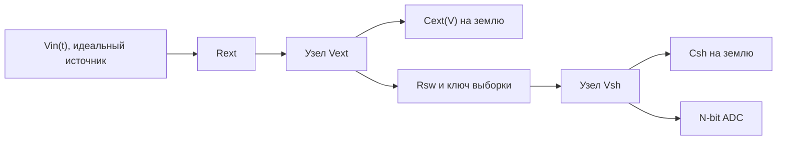

# Методология модели входного тракта АЦП

Эта страница фиксирует смысл модели и показателей, представленных во вкладке `Methodology` веб-интерфейса. Она является связующим слоем между математическим ядром, пользовательскими результатами и границами инженерной интерпретации.

## 1. Объект моделирования

Инструмент моделирует внешний RC-фильтр, подключенный к коммутируемому входу АЦП с конденсатором выборки-хранения.

- \(V_{in}(t)\) — заданный пользователем сигнал.
- \(V_{ext}(t)\) — напряжение на внешнем конденсаторе.
- \(V_{sh}(t)\) — напряжение, установленное на внутреннем конденсаторе выборки.
- \(T_{acq}\) — время замкнутого ключа.
- \(f_s\) — частота дискретизации.

## 2. Нелинейная емкость

Внешний конденсатор описывается дифференциальной емкостью, зависящей от текущего напряжения:

\[
\frac{dV_{ext}}{dt} = \frac{I_{ext}}{C_{ext}(V_{ext})}.
\]

Для C0G емкость постоянна. Для X7R/X5R и компонентных пресетов емкость уменьшается с ростом модуля приложенного напряжения. Это квазистатическое инженерное приближение: частотная дисперсия, диэлектрическая абсорбция, температура и история поляризации в основной инструмент не включены.

Подробности модели \(C(V)\): [Эффект DC bias](dc_bias.md).

## 3. Ошибка установления

В конце интервала выборки рассчитывается:

\[
e_{settling}[n] = V_{ext}[n] - V_{sh}[n].
\]

Пиковое значение показывается как аналоговое напряжение и как эквивалент в LSB. Эквивалент LSB зависит от выбранной разрядности, поэтому большое число LSB не следует интерпретировать отдельно от напряжения ошибки.

## 4. Спектральные показатели

Основные показатели:

\[
SINAD = 10\log_{10}\left(\frac{P_{fund}}{P_{noise+dist}}\right),
\]

\[
ENOB = \frac{SINAD - 1.76}{6.02},
\qquad
ENOB_{loss} = N_{bits} - ENOB,
\]

\[
THD = 10\log_{10}\left(\frac{\sum_{k=2}^{10}P_{H_k}}{P_{fund}}\right).
\]

Residual строится после вычитания из восстановленных выборок наилучшей по методу наименьших квадратов основной гармоники и постоянной составляющей:

\[
r[n] = V_{ADC}[n] - V_{fit}[n].
\]

Подробности спектрального расчета: [Нелинейные искажения и метрики](enob_loss.md).

## 5. Декомпозиция потерь

Для одной рабочей точки выполняется ablation-сравнение:

| Режим | Интерпретация |
|---|---|
| Baseline floor | Линейный C0G и идеальное наблюдение \(V_{ext}\); включает квантование и ограничения конечной FFT-записи |
| C(V) only | Нелинейная внешняя емкость при идеальном наблюдении \(V_{ext}\) |
| Settling only | Линейная емкость и реальный коммутируемый тракт выборки |
| Combined extra | Полная модель за вычетом baseline floor |
| Interaction | Отличие combined-вклада от суммы отдельных вкладов |

Ненулевой `Interaction` означает, что нелинейность емкости и недоустановление взаимодействуют и их потери нельзя точно складывать как независимые.

## 6. Численный метод

- Интерактивный режим использует semi-implicit интегрирование.
- Для контрольной проверки доступен жесткий решатель Radau.
- Спектр одиночной точки рассчитывается по 1024 выборкам с окном Blackman-Harris.
- Мощность основной гармоники и гармоник интегрируется по бинам главного лепестка.
- Начальный переходный участок исключается из пиковых диагностических оценок.

Архитектура ядра: [Python Solver Core](../entities/python_solver.md).

## 7. Границы применимости

Модель предназначена для сравнения вариантов схемы и поиска доминирующего механизма ошибки. Она не является транзисторной моделью АЦП или полной физической моделью диэлектрика.

Текущая версия интерфейса маркируется как `Experimental validation build`: расчеты следует рассматривать как исследовательскую инженерную оценку, а не как сертифицированный расчет. Возможны численные погрешности, ошибки аппроксимации модели и некорректная интерпретация режимов за пределами принятых допущений.

Не учитываются шум источника и опоры, jitter, DNL/INL, шум компаратора, динамика сопротивления ключа, частотная дисперсия и температурные эффекты MLCC. Финальная схема должна проверяться по данным конкретных компонентов и измерением.

## Связанные страницы

- [Каталог базы знаний](../index.md)
- [WebAssembly SPA оболочка](../entities/wasm_frontend.md)
- [Эффект DC bias](dc_bias.md)
- [Нелинейные искажения и метрики](enob_loss.md)
- [Python Solver Core](../entities/python_solver.md)
